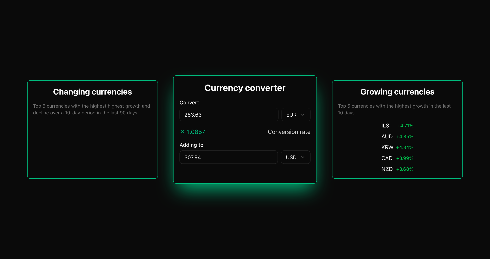

# Currency Exchange

This project implements a frontend and a backend for an exchange rate API.

## Technologies

**Frontend**: Next.js, React, TypeScript, TailwindCSS, shadcn/ui

**Backend**: Spring Boot, Java, JPA, Quartz, Jackson, Lombok, H2 Database

## Features

- [x] Exchange rates from the [European Central Bank](https://www.ecb.europa.eu/stats/policy_and_exchange_rates/euro_reference_exchange_rates/html/index.en.html)
- [x] Currency conversion API. Inputs: amount, starting currency, target currency. Output: amount in target currency.
- [x] API to get the top 5 currencies with the highest growth in the past 10 days.
- [ ] API to get the top 5 currencies with the highest growth and decline over a 10-day period in the last 90 days.
- [x] Exchange rates automatically obtained every day using Quartz.
- [x] Using H2 database for data storage.
- [x] Initially, if no rates are yet loaded, populate rates for the last 90 days.

## Testing

Due to time constraints, no tests were implemented.

## Requirements

**Frontend**: [Node.js](https://nodejs.org/), [pnpm](https://pnpm.io/)

**Backend**: [Java 21+](https://www.oracle.com/java/)

## Running the Project

There are run scripts for both the frontend and backend in the `scripts` folder.

The frontend requires the API URL to be provided via an environment variable. There is an example environment file given in `frontend/.env.example`. You can make a copy of this to `frontend/.env`.

By default backend runs on port `8080` and frontend on `3000`.
